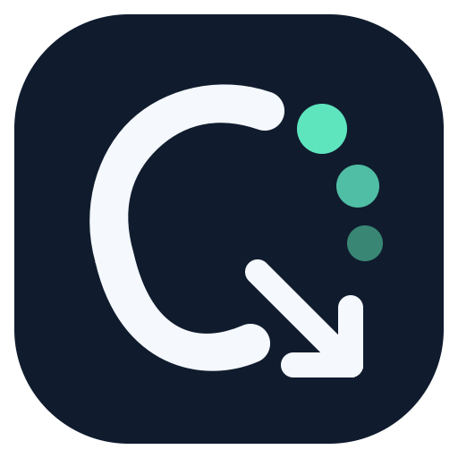
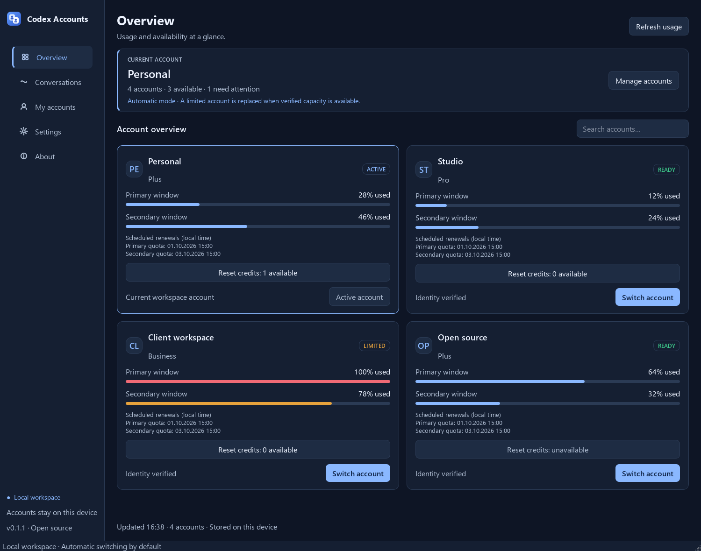
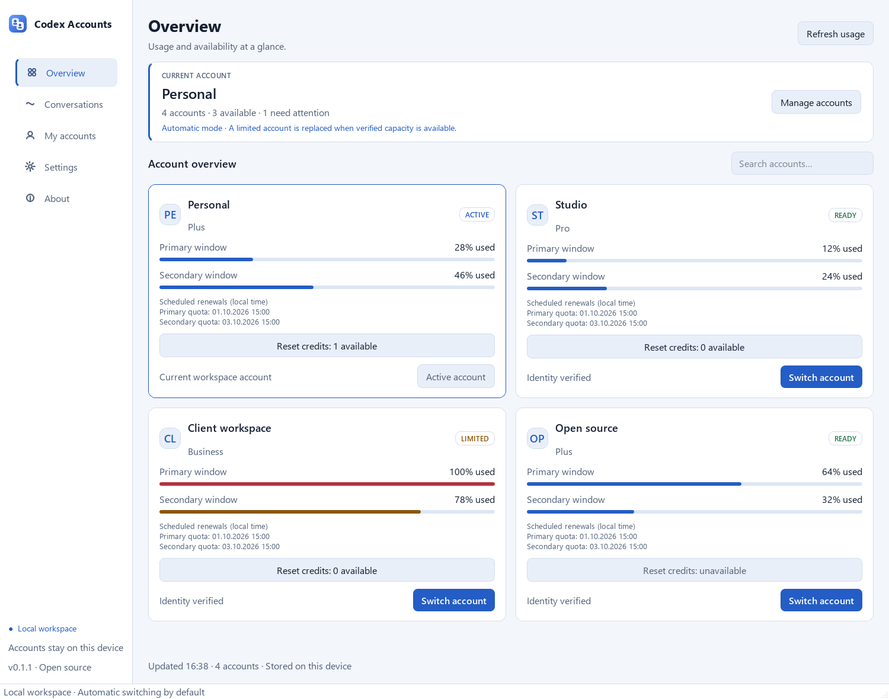

<div align="center">



# Codex Account Manager

**Switch Codex accounts. Keep working in the same Desktop conversation.**

Manage your Codex accounts and quotas in one Windows app. After a verified usage-limit interruption, automatically switch to an available account and request continuation in the same Desktop conversation.

**[Download for Windows](https://github.com/erkanpulat/codex-account-manager/releases/latest)** · [Installation guide](#get-started)

Desktop continuation is experimental and depends on your Codex version. [See tested behavior and limitations](docs/release-validation.md).

[Türkçe](README.tr.md) · [Get started](#get-started) · [How switching works](docs/continuity.md) · [Security](SECURITY.md) · [Contributing](CONTRIBUTING.md)

Windows · English / Türkçe · MIT · Installer includes Python

*Not affiliated with or endorsed by OpenAI. Use of multiple accounts is your responsibility under the applicable terms of service.*

</div>



*The real application, rendered with synthetic profiles. No account data is shown.*

## Three things, one app

- **See your accounts and quotas.** Check usage windows, scheduled renewals, available reset credits and the active account without editing configuration files.
- **Switch when a quota runs out.** Choose automatic, confirmation or manual switching, with identity checks and recovery if a switch fails.
- **Continue in Desktop.** For an observed and verified limit interruption, request continuation in the same conversation with its native goal and Desktop tools. Browse your local conversations by project.

**Native Desktop continuation is experimental.** After a verified limit and account switch, the app requests continuation through Desktop's own local tool channel. Two live quota-failure tests passed automatic switching, continuation in the same Desktop conversation, a fresh interactive browser call, native goal completion and tracking on the destination account. The integration uses a private, version-dependent protocol and polling can miss short turns; see [validation scope](docs/release-validation.md) and [continuity limitations](docs/continuity.md). Unavailable or incompatible channels fail visibly without a separate headless writer.

**CLI continuation** is enabled by default under Settings for CLI, exec, and App Server conversations. While running, the app records the identity of active conversations at each configured check. After a verified usage-limit interruption and successful account handoff, it rechecks the same turn and goal before sending a continuation message. Historical limit errors that were never observed running are skipped. It follows an active goal until it completes or needs attention; it does not resume user-interrupted work, reset goal budgets or approve tools. Disable continuation in Settings to stop automatic work. Opening a conversation or saving a local goal note alone does not start a turn. This integration requires a Codex build with the relevant App Server methods and has a documented idle-check race; see [continuity and limitations](docs/continuity.md).

## Usage reset credits

Scheduled quota renewals and reset credits appear separately on each account card. Open the credit count to see its status, scope, grant time and expiry in your local timezone. Missing data stays unavailable; it is never presented as zero. The app does not redeem credits or store credit identifiers. Redeem a credit through the matching account in Codex.

## Get started

Requires Windows and the [OpenAI Codex CLI](https://github.com/openai/codex) on `PATH`. Desktop restart support targets the packaged Windows Codex app. Linux core tests run in CI; Linux desktop lifecycle management is not included.

Download the installer or portable ZIP from [Releases](https://github.com/erkanpulat/codex-account-manager/releases/latest). The installer offers desktop and Start menu shortcuts; the portable app runs from `CodexAccountManager.exe` after extracting the entire ZIP. These builds include Python. They are not code-signed; SHA-256 checksums are provided with the release.

Building from source requires Python 3.11–3.13.

From a checkout:

```powershell
git clone https://github.com/erkanpulat/codex-account-manager.git
cd codex-account-manager
./scripts/bootstrap.ps1
.venv/Scripts/codex-account-manager.exe
```

Bootstrap creates desktop and Start menu shortcuts named **Codex Account Manager**. After setup, open either shortcut; no terminal is needed. Keep the checkout in place because the shortcuts point to its virtual environment. If you move the checkout, rerun bootstrap from the new location.

Or install into an activated virtual environment:

```powershell
python -m pip install -e ".[gui]"
codex-accounts init
codex-accounts gui
```

### Add your first account

1. Open **My accounts → Add account** and choose a name such as `work`. The form is resizable and explains what the name is used for.
2. Select the profile and choose **Sign in**. Complete Codex's sign-in flow in the terminal that opens. Account Manager binds the account after successful login.
3. Return to **Overview → Refresh usage**. Repeat for another account, then choose **Switch account**.

Choose **Settings → Language** for Türkçe or English, then quit from the tray and reopen the application. The About page explains switching modes and data storage.

<details>
<summary>See the account form</summary>


</details>

Save active work before switching: Codex Desktop restarts. Profiles contain separate login credentials; conversation history remains in the shared Codex home.

### CLI

```powershell
codex-accounts profile add work
codex-accounts profile login work
codex-accounts accounts
codex-accounts switch work
codex-accounts switch work --thread <conversation-id>
codex-accounts doctor --bundle
```

| Command | Purpose |
| --- | --- |
| `profile add / login / rename / remove` | Manage profiles and sign in. |
| `accounts`, `account <alias>`, `quota <alias>` | Inspect health and usage. |
| `bind <alias>` | Rebind a profile after signing in externally. |
| `switch <alias> [--thread <id>]` | Switch accounts, optionally restoring conversation context. |
| `continuity sync / status` | Sync conversations and inspect handoff history. |
| `resume <id>` | Load a conversation and check its saved goal. |
| `goal set <id> <objective>` | Save a local objective checkpoint. |
| `goal status / clear <id>` | Inspect or clear a local checkpoint. |
| `doctor [--bundle]` | Inspect the installation and optionally export diagnostics. |
| `gui` | Open the desktop application. |

`cx` is a short CLI alias. Run `codex-accounts --help` for all commands.

## Conversations and goals

**Tracked work** shows recently observed running conversations with their account, turn state, Codex goal state, and last check time. Select a row to read the current goal directly from Codex. The list shows up to 50 observations from the past 24 hours; a conversation appearing in the full history below does not mean it is eligible for automatic continuation. Historical limit errors are not resumed merely because the app starts.

**Conversations → Refresh conversations** reads every page of the local Codex list, ordered by actual activity. The default Main conversations filter excludes subagents; choose All sources or Subagents to include them. Source labels distinguish Desktop/VS Code, CLI, App Server and subagents. Projects use Codex project IDs where available, otherwise workspace folders. The source path and result count are visible. Ctrl+F focuses search; Ctrl+R refreshes the current view. Archived, cloud-only and other-device conversations are outside this view.

**Read Codex goal** retrieves the selected conversation’s native goal without changing it. **Save local goal note** stores an objective in this app; it does not start work or update Codex immediately. A later load or handoff may restore that objective if Codex confirms the native goal is missing. Local notes and system checks are under **Settings**. See [the exact goal behavior](docs/continuity.md#goals).

## Light theme

<details>
<summary>See the light appearance</summary>



</details>

## Data and security

Account Manager stores settings, profiles, and checkpoints locally. It has no telemetry service or credential proxy. Codex itself connects to OpenAI for authentication and account information.

- App data is stored under `%LOCALAPPDATA%/CodexAccountManager`; Codex conversation files remain in `~/.codex`. System check shows the actual paths used by your installation.
- Auth files and temporary recovery snapshots contain credentials. Windows ACLs restrict files written by Account Manager to the current user; Unix writes use mode `0600`. These files are **not encrypted**.
- A process lock prevents concurrent account mutations. Interrupted switches are recovered when the GUI starts or before the next switch.
- Diagnostic exports include allowlisted check statuses, a validated CLI version and profile count. They exclude aliases, paths, raw errors, logs, credentials, databases and conversation content.

See [security and reporting](SECURITY.md), [the threat model](SECURITY.md#trust-boundaries-and-limitations), and [Windows setup](docs/troubleshooting.md#windows-installation-and-shortcuts). No audit can guarantee the absence of every vulnerability.

## Development

```powershell
python -m pip install -e ".[gui,dev]"
python -m ruff check src tests scripts
python -m ruff format --check src tests scripts
python -m mypy src
python -m pytest -q
```

Tests use isolated temporary paths and fake Codex/Desktop adapters. GUI tests run offscreen. `python scripts/render_preview.py` regenerates the screenshots without accessing any real accounts.

CI runs lint, type checks, tests on Windows/Linux and Python 3.11–3.13, dependency auditing, secret scanning, and a wheel build. See [packaging](packaging/README.md) for local Windows executable and installer builds. Published binaries and checksums are attached to the matching GitHub release.

## Project details

[Report a bug](https://github.com/erkanpulat/codex-account-manager/issues/new/choose) · [Release history](CHANGELOG.md)

[Architecture](CONTRIBUTING.md#code-structure) · [Codex protocol](CONTRIBUTING.md#codex-integration) · [Troubleshooting](docs/troubleshooting.md)

MIT licensed. Independent community software, not affiliated with or endorsed by OpenAI. "OpenAI" and "Codex" are trademarks of OpenAI. You are responsible for complying with all applicable terms of service when using this tool with your accounts.
