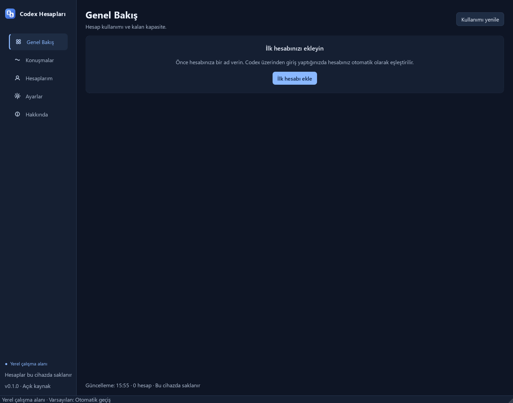
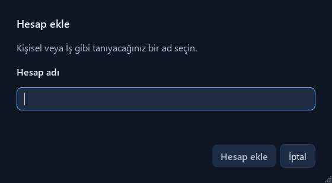
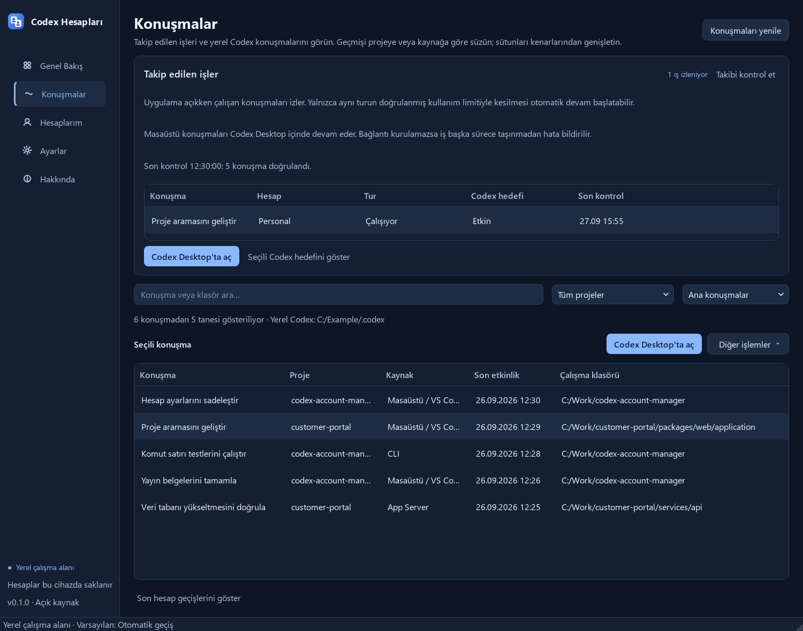

# Codex Hesap Yöneticisi

**Birden fazla Codex hesabını tek cihazda yönetin, kullanım kotalarını takip edin ve hesaplar arasında geçiş yapın.**

[English](README.md) · [Güvenlik](SECURITY.md) · [Doğrulama raporu](docs/release-validation.md)



## Ne işe yarar?

- Hesaplarınıza Kişisel veya İş gibi adlar verin ve resmî Codex giriş akışıyla oturum açın.
- Hesapların kullanım kotalarını, yenilenme zamanlarını ve doğrulama durumlarını görün.
- Codex Desktop’ın kullandığı hesabı değiştirirken ortak konuşma geçmişini koruyun.
- Kaydedilen konuşmaları yükleyin ve yerel hedef kayıtlarını yönetin.
- Türkçe/İngilizce arayüz, açık/koyu tema ve açıklamalı sistem kontrolünü kullanın.

## Çalıştırma

Windows ve PATH üzerinde erişilebilir [Codex CLI](https://github.com/openai/codex) gerekir. [Sürümler](https://github.com/erkanpulat/codex-account-manager/releases/latest) sayfasından kurulum dosyasını veya taşınabilir ZIP paketini indirin. Kurulum masaüstü ve Başlat menüsü kısayolları sunar. Taşınabilir paketin tamamını çıkardıktan sonra `CodexAccountManager.exe` dosyasını açın. Bu paketler Python içerir; ayrıca Python kurmanız gerekmez. Dosyalar kod imzalı değildir; SHA-256 sağlama değerleri sürümle birlikte yayımlanır.

Kaynaktan kurmak için Python 3.11–3.13 gerekir. PowerShell'de:

```powershell
git clone https://github.com/erkanpulat/codex-account-manager.git
cd codex-account-manager
./scripts/bootstrap.ps1
.venv/Scripts/codex-account-manager.exe
```

Kurulum, masaüstüne ve Başlat menüsüne **Codex Account Manager** kısayollarını da ekler; sonraki açılışlarda terminal gerekmez. Proje klasörünü taşırsanız kısayolları güncellemek için kurulum betiğini yeniden çalıştırın.

## İlk giriş

1. **Hesaplarım → Hesap ekle** yolunu izleyin ve bir ad yazın.
2. Eklediğiniz hesabı listeden seçip **Giriş yap** düğmesine basın.
3. Açılan resmî Codex giriş akışını tamamlayın. Hesabınız otomatik olarak eşleştirilir.
4. **Genel Bakış → Kullanımı yenile** düğmesiyle bilgileri alın.
5. Başka bir hesap eklediğinizde **Bu hesaba geç** düğmesini kullanabilirsiniz.

<details>
<summary>Hesap ekleme penceresini gör</summary>



</details>

Dil seçimi **Ayarlar → Dil** bölümündedir. Değişikliği uygulamak için sistem tepsisindeki menüden **Çıkış** seçeneğini kullanıp uygulamayı yeniden açın. Pencereyi kapatmak, sistem tepsisi kullanılabiliyorsa uygulamayı sonlandırmaz.

## Otomatik mi çalışır?

**Desktop içinde devam bağlantısı deneyseldir.** Uygulama, doğrulanmış limit ve hesap geçişinden sonra aynı konuşmaya Desktop'ın kendi yerel araç kanalından devam isteği gönderir. Gerçek kota hatasıyla yapılan iki canlı testte otomatik hesap geçişi, aynı sohbette devam, yeni bir etkileşimli tarayıcı işlemi, Codex hedefinin tamamlanması ve yeni hesapta takibin sürmesi doğrulandı. Bu bağlantı Desktop sürümüne bağlı özel bir protokol kullanır. Bağlantı doğrulanamazsa durum bildirilir; konuşma ayrı bir arka plan oturumuna taşınmaz. Testlerin kapsamı ve sınırları [doğrulama raporundadır](docs/release-validation.md).

**Varsayılan mod otomatiktir.** Ayarlar’dan manuel veya onaylı modu da seçebilirsiniz.

| Mod | Davranış |
| --- | --- |
| Manuel | Yalnızca seçtiğiniz hesaba geçer. |
| Geçiş yapmadan önce sor | Etkin hesabın kotası dolduğunda uygun hesaba geçiş önerir; onayınızı bekler. |
| Otomatik geçiş | Kota dolduğunda doğrulanmış ve kullanılabilir bir hesaba geçer; uygulama açıkken çalıştığı izlenen ve limitle kesilen konuşmayı yüklemeyi dener. |

Kontrol, uygulama açıkken varsayılan olarak **60 saniyede bir** yapılır. **Ayarlar → Kontrol aralığı** bölümünden 30–3600 saniye arasında değiştirebilirsiniz; değişiklik hemen uygulanır. Hesap geçişi Codex Desktop’ı yeniden başlatır; önce çalışmalarınızı kaydedin.

**Yalnızca konuşmayı yüklemek veya yerel hedef notu kaydetmek model çalışması başlatmaz.** Otomatik devam açıkken uygulama, her kontrolünde çalışan konuşmanın kimliğini ve hedef durumunu kaydeder. Aynı tur kullanım limitiyle kesilir ve hesap geçişi başarılı olursa son turu ve hedefi yeniden doğrular. Desktop konuşmasına Desktop'ın kendi kanalından, CLI konuşmasına App Server üzerinden devam isteği gönderir. Hedefin amacı, bütçesi ve kullanımı korunur; araç izinleri otomatik onaylanmaz.

Çalışırken gözlemlenmeyen eski limit kayıtları devam ettirilmez. Konuşma veya hedef değişmişse işlem durur ve uygulama durumu bildirir. Kontrol aralığından daha kısa süren işler gözden kaçabilir. Devam isteğinden hemen önce kullanıcının yeni bir tur başlatmasıyla oluşabilecek yarış koşulu tamamen giderilmiş değildir. Ayrıntılar için [devam davranışına](docs/continuity.md) bakın.

## Konuşmalar ve projeler

**Takip edilen işler** bölümünde, uygulama açıkken çalışan ve izlenen konuşmaları; hesap, tur durumu, Codex hedefinin durumu ve son kontrol zamanı ile görebilirsiniz. Listedeki bir hedefin güncel içeriğini seçerek Codex'ten okuyabilirsiniz. Bu bölüm son 24 saatte izlenen en fazla 50 kaydı gösterir; konuşma geçmişindeki her kayıt otomatik devam adayı değildir. Uygulama ilk açıldığında geçmişte kalmış limit hataları kendiliğinden devam ettirilmez.

**Konuşmalar → Konuşmaları yenile** yerel Codex kayıtlarını yeniden okur. Tüm sayfalar okunur ve sonuçlar son etkinliğe göre sıralanır. Başlıkta veya klasörde arama yapabilir; proje ve kaynak filtrelerini birlikte kullanabilirsiniz. Proje kimliği varsa ona, yoksa çalışma klasörüne göre gruplama yapılır.

Varsayılan **Ana konuşmalar** filtresi alt ajanları gizler. **Tüm kaynaklar** veya **Alt ajanlar** seçeneğiyle bu kayıtları da görebilirsiniz. `Ctrl+F` aramayı açar; `Ctrl+R` mevcut sayfayı yeniler.

Kaynak sütunu konuşmanın Masaüstü/VS Code, CLI veya alt ajan kaydı olduğunu gösterir. Uzun klasör yollarının üzerine gelince tam metin görünür; sütun kenarlarını sürükleyerek genişletebilir, **Diğer işlemler → Konuşma ayrıntılarını göster** seçeneğinden tam metni açıp kopyalayabilirsiniz. Listenin üstünde okunan Codex klasörü ve kayıt sayısı bulunur. Yalnızca bulutta veya başka cihazda bulunan ve arşivlenmiş konuşmalar bu listede yer almaz.



## Hedef kaydet ne yapar?

- **Codex hedefini göster**, seçtiğiniz konuşmadaki gerçek Codex hedefini okur; değiştirmez.
- **Yerel hedef notu kaydet**, yalnızca bu uygulamada bir kayıt oluşturur. Codex’te hedef başlatmakla aynı işlem değildir; model çalışmaya başlamaz.
- Konuşma daha sonra yüklenirken veya hesap geçişinde, Codex hedefin eksik olduğunu doğrularsa bu kayıt geri yükleme için kullanılabilir. Mevcut hedef değiştirilmez; duraklatılmış, tamamlanmış, engellenmiş ve bu uygulamada temizlenmiş kayıtlar yeniden etkinleştirilmez.
- Yerel notu temizlemek Codex’teki hedefi silmez. Yerel kayıtlar **Ayarlar → Yerel Hedef Notları** altındadır.

## Sistem kontrolü ve gizlilik

**Ayarlar → Sistem Kontrolü** sayfasında Codex CLI, sürüm bilgisi, veri klasörü ve hesap durumu incelenir. Bir sonuca tıklayarak açıklamanın tamamını görebilirsiniz. Sürüm okunamıyorsa terminalde `codex --version` komutunu çalıştırın; CLI kurulumu veya PATH değiştiyse uygulamayı yeniden açın.

Hesap giriş bilgileri ve ayarlar yerel cihazda saklanır. Uygulama telemetri toplamaz; Codex ise giriş ve hesap bilgileri için OpenAI’a bağlanır. Tanılama dışa aktarımı yalnızca kontrol durumlarını, doğrulanan CLI sürümünü ve hesap sayısını içerir; hesap adları, dosya yolları, ham hata metinleri ve günlükler eklenmez. Depodaki ekran görüntüleri örnek hesaplarla üretilmiştir.

Bu bağımsız, MIT lisanslı proje resmî bir OpenAI ürünü değildir. Hesap kotalarını artırmaz. Test edilen kapsam ve bilinen sınırlamalar [doğrulama raporunda](docs/release-validation.md) listelenir.
